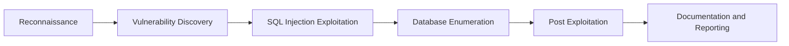

# Penetration-Testing-Lab
Web application penetration testing lab using DVWA, Kali Linux, sqlmap, and Metasploit

# 🛡️ Penetration Testing & Vulnerability Assessment Lab

## ⚙️ Technologies

Kali Linux • DVWA • sqlmap • Metasploit • MySQL • Web Security • Offensive Security

## 📌 Overview

This project demonstrates a practical penetration testing workflow against a deliberately vulnerable web application environment using Kali Linux and DVWA (Damn Vulnerable Web Application).

The objective of the lab was to identify, exploit, validate, and document common web application vulnerabilities in a controlled environment.

## 🖥️ Lab Environment

* **Kali Linux** – attacker machine and security testing platform
* **DVWA** – vulnerable web application target
* **MySQL** – backend database system
* **sqlmap** – automated SQL injection testing
* **Metasploit Framework** – exploitation and post-exploitation framework

## 🔄 Workflow

1. **Reconnaissance** – Identify application structure and attack surface.
2. **Vulnerability Discovery** – Detect SQL injection vulnerabilities.
3. **Exploitation** – Exploit vulnerabilities using manual testing and sqlmap.
4. **Validation** – Verify database access and backend structure.
5. **Post-Exploitation** – Perform additional testing using Metasploit.
6. **Documentation** – Record findings and remediation recommendations.

## 🧪 Key Activities

* Configured and deployed DVWA in a Kali Linux environment
* Performed authenticated SQL injection testing using sqlmap
* Identified boolean-based SQL injection vulnerabilities
* Exploited error-based SQL injection vulnerabilities
* Demonstrated time-based blind SQL injection techniques
* Performed UNION-based SQL injection attacks
* Enumerated database names, tables, and backend DBMS information
* Validated MySQL backend version and structure
* Used Metasploit Framework for post-exploitation activities
* Created professional penetration testing documentation

## 📂 Tools Used

* **DVWA** – vulnerable web application
* **Kali Linux** – penetration testing operating system
* **sqlmap** – SQL injection automation
* **Metasploit Framework** – exploitation platform
* **Burp Suite** – web application proxy and analysis
* **Firefox Developer Tools** – request analysis and debugging

## ✅ Key Takeaways

* Built a practical offensive security testing lab
* Performed real-world web application testing techniques
* Learned multiple SQL injection methodologies
* Practiced authenticated web application testing
* Validated exploitation results against backend databases
* Developed penetration testing documentation skills

## 🛡️ Skills Demonstrated

* Penetration Testing
* SQL Injection
* Vulnerability Exploitation
* Web Application Security
* Offensive Security
* Authentication Testing
* Database Enumeration
* Post-Exploitation
* Security Reporting
* Risk Validation

## 🔄 Penetration Testing Workflow

## 🚀 Future Improvements

* Add XSS testing scenarios
* Add file upload vulnerability testing
* Add authentication bypass testing
* Include Burp Suite automation workflows
* Expand testing to API security scenarios

## 🔗 References

* [DVWA](https://github.com/digininja/DVWA)
* [sqlmap](https://sqlmap.org/)
* [Metasploit Framework](https://www.metasploit.com/)
* [OWASP Web Security Testing Guide](https://owasp.org/www-project-web-security-testing-guide/)

## ⚠️ Disclaimer

This project was created for educational and authorized cybersecurity training purposes only.
